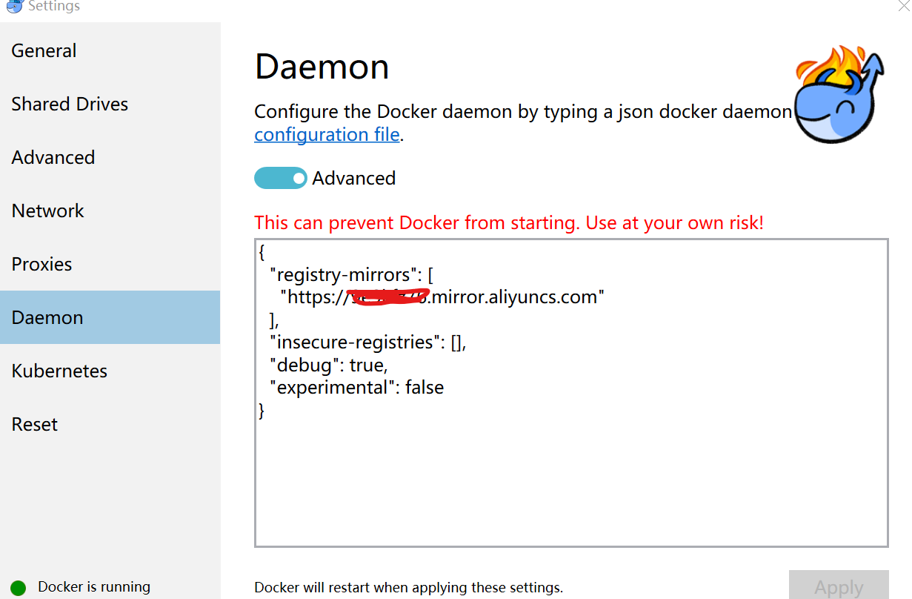
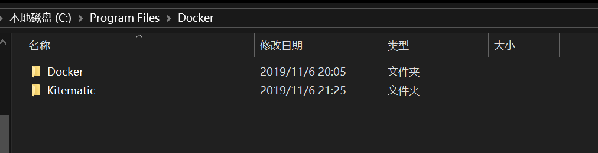
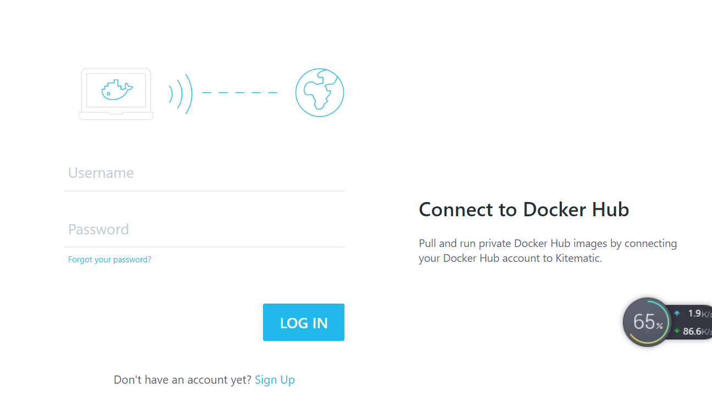
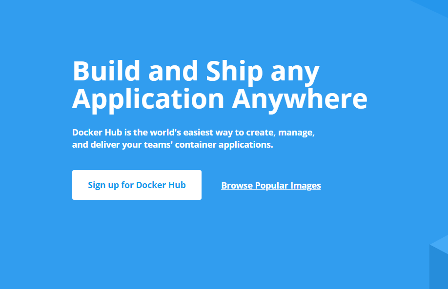
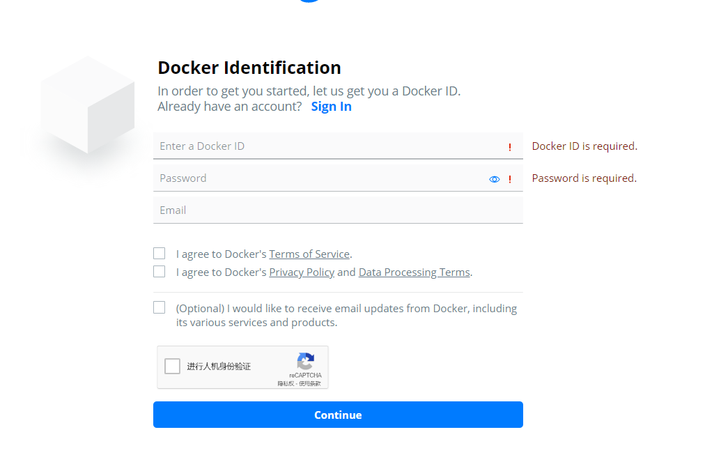
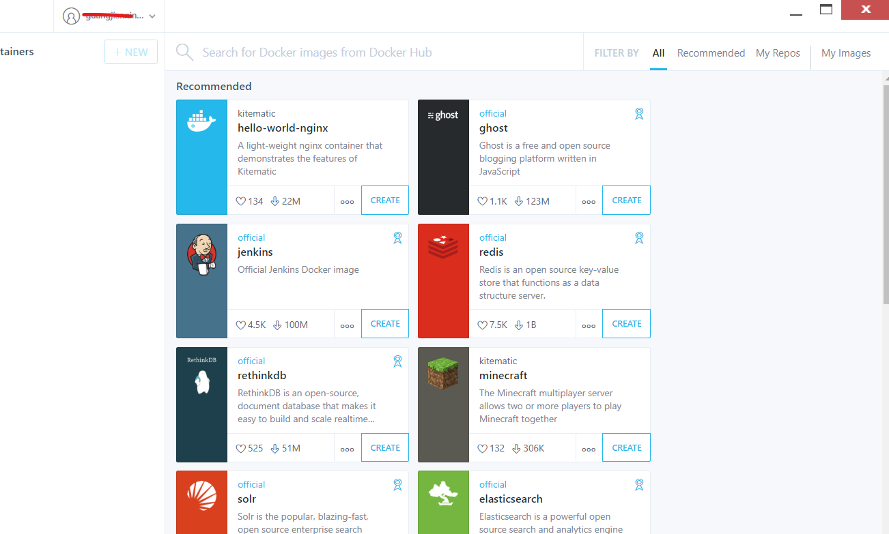

## 下载安装
#### 这里就不多说了,需要先开启win10的Hyper-V对虚拟机 再安装docker
## docker镜像的加速配置

1. https://yq.aliyun.com/articles/29941  打开这个链接以后出现以下网页，按照截图说明进行

)

2. 在此之前得申请阿里云账户，然后登陆出现以下页面，然后截图指示找到dockerhub加速的阿里云镜像，点击复制

3. 将第一步的镜像复制到docker-setting-daemon里面的
	
	"registry-mirrors": [
    "https://xxx.mirror.aliyuncs.com"
  ]

4. 点击apply，docker将重启生效

## Kitematic的安装
1. 下载Kitematic的zip压缩包,选中任务栏docker图标，右键Kitematic点击，第一次点击会打开浏览器下载它的压缩包

2. 将压缩包解压到docker（C:\Program Files\Docker）安装目录下，并将解压后的文件命名为Kitematic

3. 再次点击任务栏docker中的Kitematic就会出现登录界面，此时在这里注册是没用的。

4. 浏览器打开dockerhub的网站注册一个dockerhub账户,按照三张图的顺序注册。

5. 回到本机Kitematic登录界面，把第第四步注册的账户输入登录

